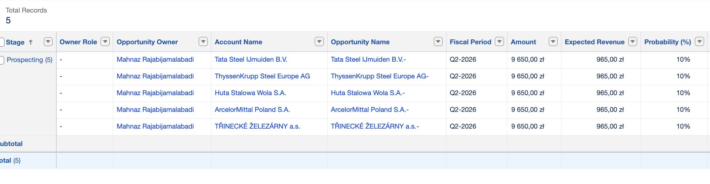
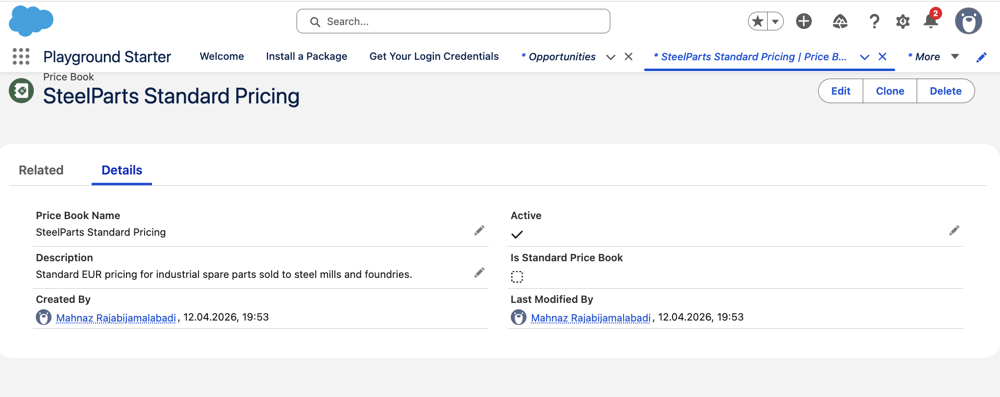
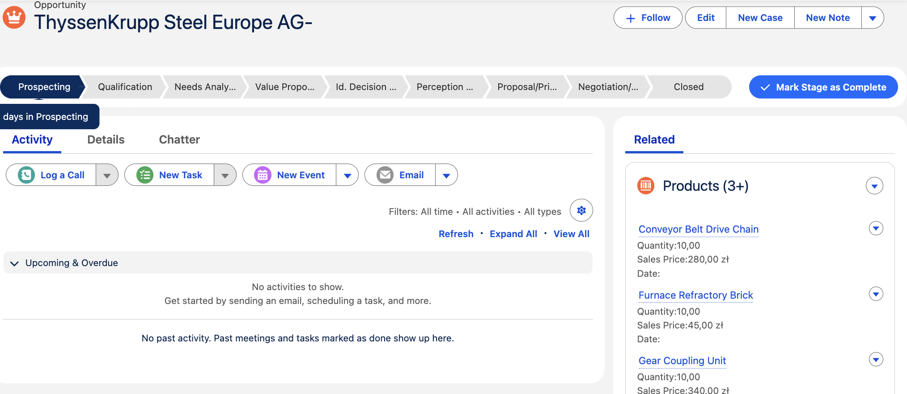
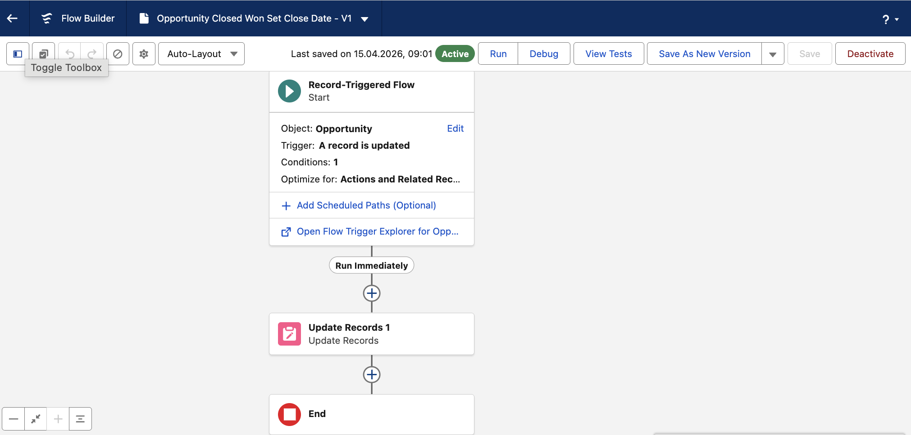
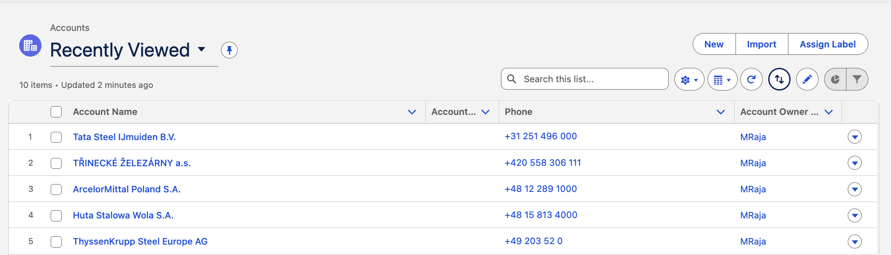

# 🏭 SteelParts CRM — Salesforce Sales Cloud Portfolio Project

**Built by:** Mahnaz Rajabi | Salesforce Business Analyst | Salesforce Admin
**Industry:** Steel & Foundry (B2B)
**Platform:** Salesforce Sales Cloud
**Contact:** mahnazrajabi444@gmail.com

---

## 📌 Project Overview
A full end-to-end Salesforce Sales Cloud CRM implementation for a fictional B2B steel industry company — **SteelParts**. Built to demonstrate real-world Salesforce Admin and Business Analyst skills for enterprise B2B sales operations.

---

## ✅ What Was Built

### 1. Lead Management & Conversion
- Created and qualified 5 B2B leads representing major European steel companies
- Converted leads into linked **Accounts, Contacts, and Opportunities**
- Companies: TŘINECKÉ ŽELEZÁRNY, Voestalpine AG, ArcelorMittal, U.S. Steel Košice, Salzgitter AG

### 2. Product Catalog & Price Book
- Created custom Price Book: **SteelParts Standard Pricing**
- Added 6 industrial products with SKUs and pricing (PLN)

| SKU | Product | Price |
|-----|---------|-------|
| SP-001 | Industrial Roller Bearing | 85 zł |
| SP-002 | Mechanical Seal Assembly | 120 zł |
| SP-003 | Gear Coupling Unit | 340 zł |
| SP-004 | Furnace Refractory Brick | 45 zł |
| SP-005 | Hydraulic Pump Seal Kit | 95 zł |
| SP-006 | Conveyor Belt Drive Chain | 280 zł |

### 3. Opportunity Management
- Attached all 6 products to each Opportunity
- Full itemised sales records with quantities and pricing

### 4. Process Automation — Flow Builder
- Built a **Record-Triggered Flow** on Opportunity object
- Trigger: Stage updated to **Closed Won**
- Action: Auto-sets Close Date to current date
- Result: Zero manual entry, clean CRM data

### 5. Custom Reports & Dashboards
- Built Opportunities Pipeline report grouped by Stage
- Columns: Account Name, Opportunity Name, Stage, Amount, Close Date, Probability
- Full pipeline visibility for sales management

---

## 🛠 Salesforce Features Used
- Leads & Lead Conversion
- Accounts, Contacts, Opportunities
- Products & Price Books
- Flow Builder (Record-Triggered Flow)
- Reports & Dashboards
- Lightning App Builder

---

## 🎯 Skills Demonstrated
- Salesforce Sales Cloud configuration
- B2B CRM implementation
- Process automation without code
- Data modelling and relationships
- Pipeline reporting and analytics

---

## 📸 Screenshots
### Opportunities Pipeline

### Price Book

### Opportunity Record with Products

### Flow Builder Automation

### Accounts List

---

## 👩‍💼 About Me
**Mahnaz Rajabi** — Salesforce Business Analyst | Salesforce Admin
- 📧 mahnazrajabi444@gmail.com
